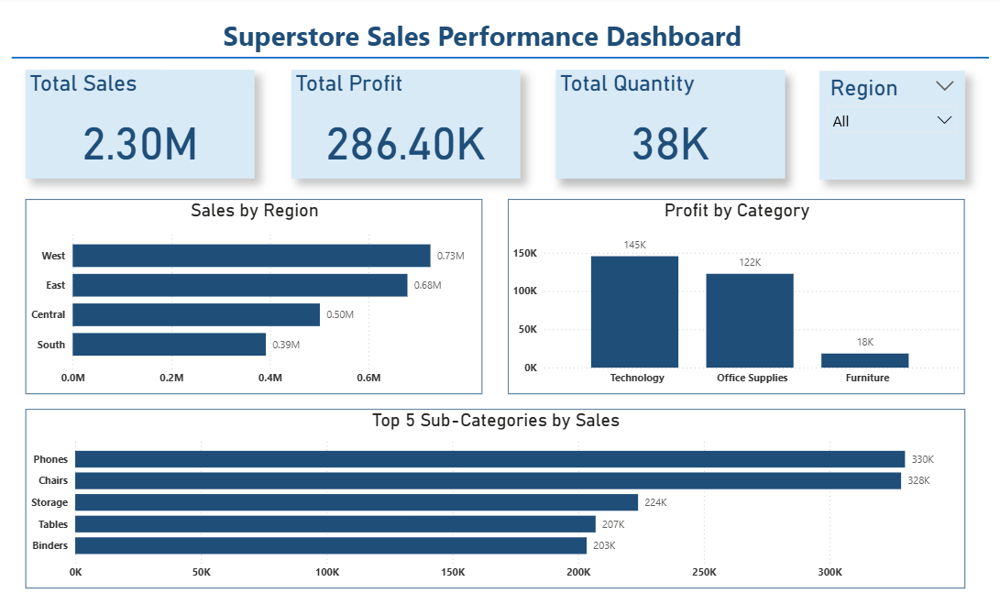

# Superstore Sales Analysis

## Project Overview
This project analyzes retail sales data from a Superstore dataset using Python and Power BI.

The goal of the project is to identify sales trends, profitable categories, top-performing regions, and business insights through data analysis and visualization.

## Tools & Technologies
- Python
- Pandas
- Matplotlib
- Jupyter Notebook
- Power BI

## Key Business Insights
- Total Sales: 2.30M
- Total Profit: 286K
- Total Quantity Sold: 38K
- West Region generated the highest sales
- Technology category generated the highest profit
- Phones and Chairs were the top-selling sub-categories

## Dashboard Preview

## Files Included
- SampleSuperstore.csv
- Superstore_Sales_Analysis.ipynb
- Superstore_Sales_Dashboard.pbix

## Skills Demonstrated
- Data Cleaning
- Exploratory Data Analysis (EDA)
- Data Visualization
- Business Intelligence Reporting
- Dashboard Design
- Business Insight Generation

## Project Outcome
Developed an interactive Power BI dashboard that helps stakeholders monitor sales performance, profitability, regional trends, and product category performance.
